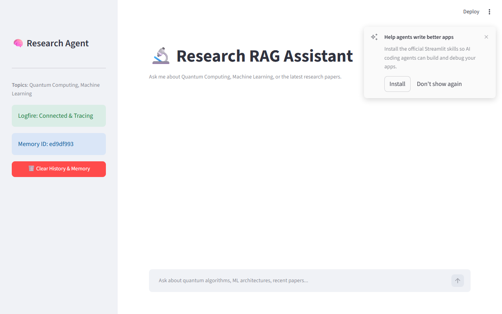
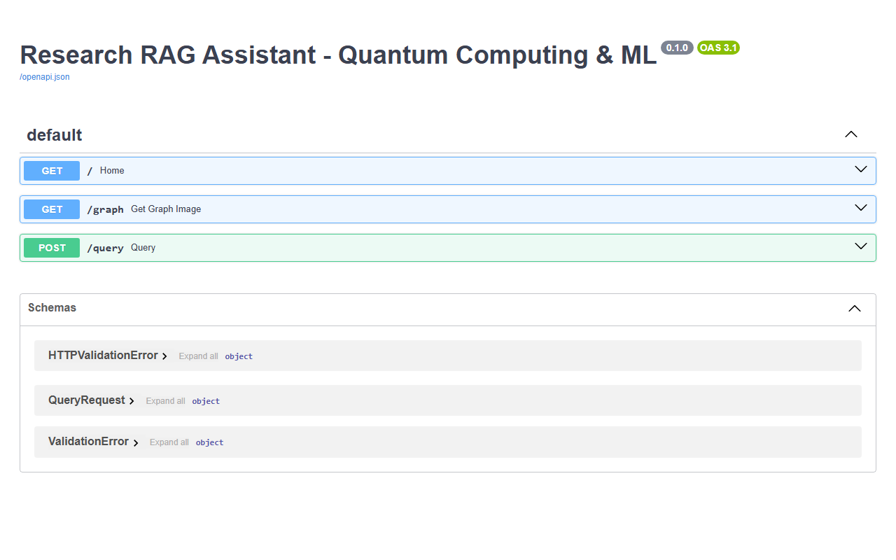

# 🔬 QuantumRAG: Research Agentic RAG Assistant

> **QuantumRAG** is an advanced Agentic Retrieval-Augmented Generation (RAG) system specialized in **Quantum Computing and Machine Learning**. 

This system employs an intelligent multi-agent pipeline (Planner -> Retriever -> Responder) combined with NeMo Guardrails to act as a highly accurate Research Scientist.



## 🌟 Key Features

* **Agentic Planner**: Analyzes conversations to distinguish between conversational chit-chat (handled by memory) and deep technical queries (handled via Qdrant semantic search).
* **NeMo Guardrails**: Prevents jailbreaks, off-topic prompts, and enforces strict adherence to Quantum Computing & ML topics.
* **Semantic Reranking**: Uses `FlashRank` Cross-Encoders locally to re-rank vector search results for superior accuracy.
* **Portkey Gateway Integration**: Includes built-in observability, metrics, and routing through Portkey's Gateway.
* **Logfire Telemetry**: Fully instrumented traces of the agent's thought processes and tool calls.
* **Modern Streamlit UI**: Beautiful frontend that streams responses and displays the agent's step-by-step reasoning.

---

## 📸 Screenshots

### 1. Web Interface (Streamlit)
The user interface allows you to view the agent's thought process, the retrieved chunks from Qdrant, and streams the final answer from the Groq LLM.


### 2. FastAPI Backend & Agent Architecture
The backend is powered by FastAPI and `langgraph`. It exposes an endpoint that orchestrates the RAG pipeline.



---

## 🛠️ Architecture

1. **User Input** ? NeMo Guardrails (Checks if off-topic/jailbreak).
2. **Planner Agent** ? Analyzes conversation history and decides if a search query is needed.
3. **Retriever Node** ? Queries **Qdrant** using Gemini embeddings.
4. **Reranker Node** ? Uses **FlashRank** to pick the absolute top 5 most relevant documents.
5. **Responder Agent** ? Synthesizes the final answer using a **Groq LLM (Llama 3.3 70B)** via the **Portkey Gateway**.

---

## 🚀 Getting Started

### Prerequisites
* Python 3.12+
* `uv` package manager

### 1. Installation
Clone the repository and install dependencies:
```bash
uv pip install -r requirements.txt
```

### 2. Environment Variables
Create a `.env` file in the root directory:
```env
# Vector Database
QDRANT_URL=your_qdrant_url
QDRANT_API_KEY=your_qdrant_api_key

# Embeddings & Inference
GEMINI_API_KEY=your_gemini_key
GROQ_API_KEY=your_groq_key

# Observability
LOGFIRE_TOKEN=your_logfire_token
PORTKEY_API_KEY=your_portkey_key
```

### 3. Run the Backend (FastAPI)
```bash
uvicorn app.main:app --port 8000
```

### 4. Run the Frontend (Streamlit)
```bash
streamlit run ui/app.py --server.port 8501
```

Navigate to `http://localhost:8501` to start chatting with your research assistant!
